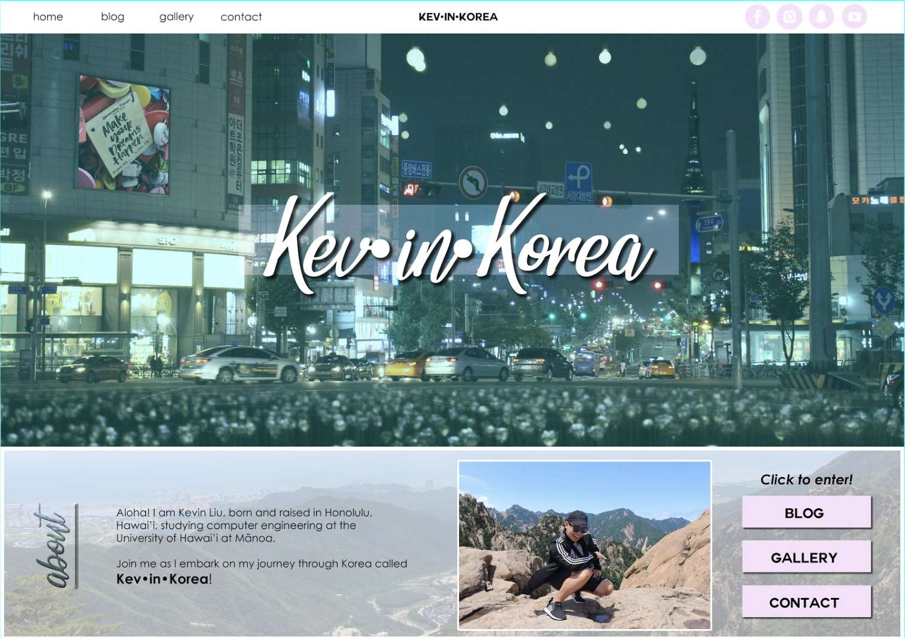

Ever since my childhood, I have been absolutely interested in technology by constantly being surrounded by it. In fact, in one of my childhood photo albums, there's a childhood picture of me playing on the computer. Continuing onto middle school, I started to play online computer games such as MapleStory and Combat Arms with my friends. Then in high school, I got interested in digital media, design, and technology, taking classes that includes STEMworks, Broadcast, and Yearbook. On my free time, I like to create event recaps videos such as making travel videos when I went to Japan and Korea. Check my video that I recently made to recap my summer 2018 in Korea below. 

With my wide range of interests in designing, digital media, and technology, I decided to study in computer engineering since it relates to all of those topics. By studying within this field, I hope to be able to express my creativity in technology by engineering. Thus far, I have been enjoying my classes that allows me to express this creativity. For example, this past summer of 2018, I studied abroad in Seoul, South Korea at Yonsei University, taking "Introduction to Computer Graphics" and "Energy and Environment" to enhance my knowledge in these backgrounds. It was a great opportunity to learn more about those subjects while experiencing a new culture. Below is an image of a website I designed for the "Introduction to Computer Graphics" class. 

By taking ICS 314 at the University of Hawaii at Manoa, I hope to learn valuable skills and gain professional expertise. With this Software Engineering class, my goal is to learn new coding languages, concepts, and become a better coder. In addition, I plan to build upon my personal skills such as teamwork, time management, and perserverance. With these skill sets, I shall be able to design my own pathway towards my future!
