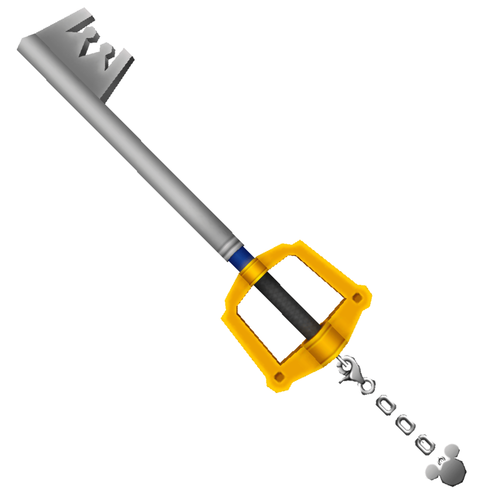

# Kingdom Hearts
At the heart of every code, there are coding standards evident in each line. Coding standards has both its ups and downs in general like every video game, showcasing the good and bad behind implementing this style of coding. By utilizing ESLint in IntelliJ IDEA, I was able to get a first-hand experience of both sides during this process. Personally, I really liked changing our environments from JSFiddle to IntelliJ IDEA since it organizes the project files neatly on the sidebar. 

## Heartless
Coding standards is very precise in its style, being very picky about the small details of your code. It truly is like one of the "heartless" enemies from Kingdom Hearts, being simple to defeat but very annoying at the same time. During this week of using ESLint on IntelliJ IDEA, I got triggered at the very trivial errors such as adding an extra space after the end of the file or after declaring an if or for statement. It seems useless during these points of debugging since the formatting of code does not really affect the compilation of the project. 

## Keyblade
Even though it may seem heartless at first, coding standards provide the Keyblade to learning software engineering. Sometimes, it tells you valuable debugging information in order to fix the code, being an ally during that time of need. By being equipped with this style of coding, it gives a legible and cleaner format to the files, making it readable for all programmers over the world reading the code. Having a standard way of coding provides a great learning foundation to gaining knowledge of new coding languages, thus teaching how to write code neatly and effectively. Coding standards are the Keyblade to becoming a better software engineer.
