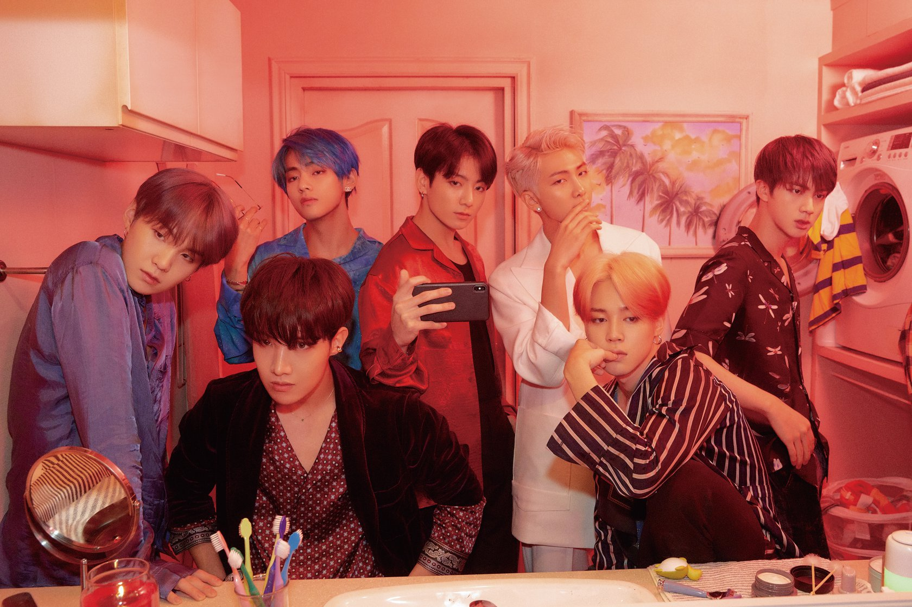

# Kpop to My Ears
Design patterns are basically a repeatable solution that can be applicable to solving a variety of commonly-occuring problems, speeding up the development process in the software development field. Similarly, Korean pop music can be designed in a similar fashion, creating hits one after the other. 

There are three different types of design patterns: creational design patterns, structural design patterns, and behavioral design patterns. Creational design patterns is class instantiation, similarly to the starts of Kpop stars, going through an audition process to become an idol. Structural design patterns is about class and object compositions, just like the strucuture of producing Kpop hits within the company. Lastly, behavioral design patterns are the communication between objects, like the group's fan club page where they communication from the company to the fans. 

# Charting Progress
Without even knowing, design patterns have appeared on our radar, charting hits within our works. For example, we have utilized this idea within our current final project - Boujee Foodie. The Semantic UI React and Meteor serves as various design patterns that is transferrable to various projects as an initial template to implement. For example, we utilized it to create these collections and tools to be portrayed onto the website. It provided easy solutions to the problems I encountered of using these tools.
