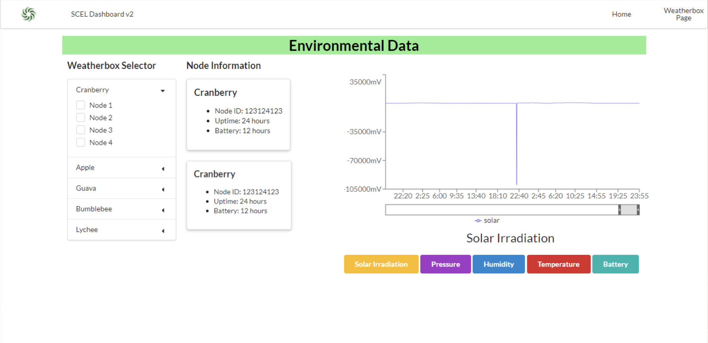

The Smart Campus Energy Lab is dedicated to collecting meteorological data by deploying environmental sensory nodes called "weatherboxes" on the roof of Holmes Hall; this collection of data is then utilized to predict forecast weather which would allow for the sustainability of energy by collecting and storing solar energy properly. The project's future goal is to turn the University of Hawaii at Manoa into a micro-grid, a small-scale grid that is self-sustainable by creating enough energy as needed so that the land may thrive without being connected to the power grid. 

With the data collection by the many deployed weatherboxes, the web dashboard was created to allow client users to visualize the data graphically and aesthetically. In this iteration of the dashboard, my team decided to continue using the React framework since it was widely used in the work field at the time. Thus, we utilized JavaScript, Hypertext Markup Language (HTML), and Cascading Style Sheets (CSS) in order to create the user interface. 

Given a past dashboard prototype, we decided to improve upon that by successfully finalizing the graph generator page. On this page, users would be able to select various weatherbox nodes and view its information as well as showcase the collected data in the gateway on a graph. We divided the page into three sections: the accordion selector, the node information, and the graph generator; by utilizing the React.js framework, we were able to generate a tentatively working page based on hard-coded data.

This project provided an introduction to new languages and frameworks that I have not worked with such as JavaScript, React, HTML, and CSS, providing a great exposure to more software engineering topics. It was a steep learning curve as we needed to manage our time in order to complete this project; nonetheless, we were able to accomplish a working prototype of the graph generator page!
 
You can learn more at the [Wiki SCEL Dashboard V2](https://wiki.scel-hawaii.org/doku.php?id=weatherbox:dashboard_v2:start).
