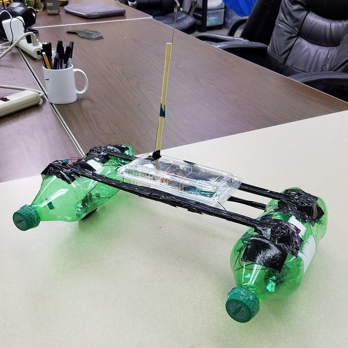
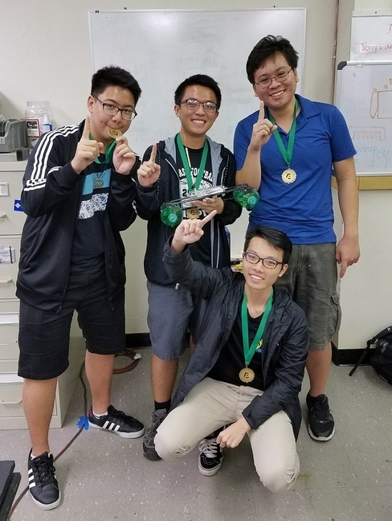
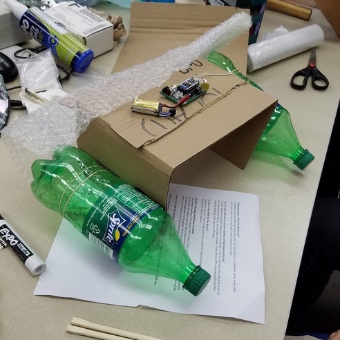
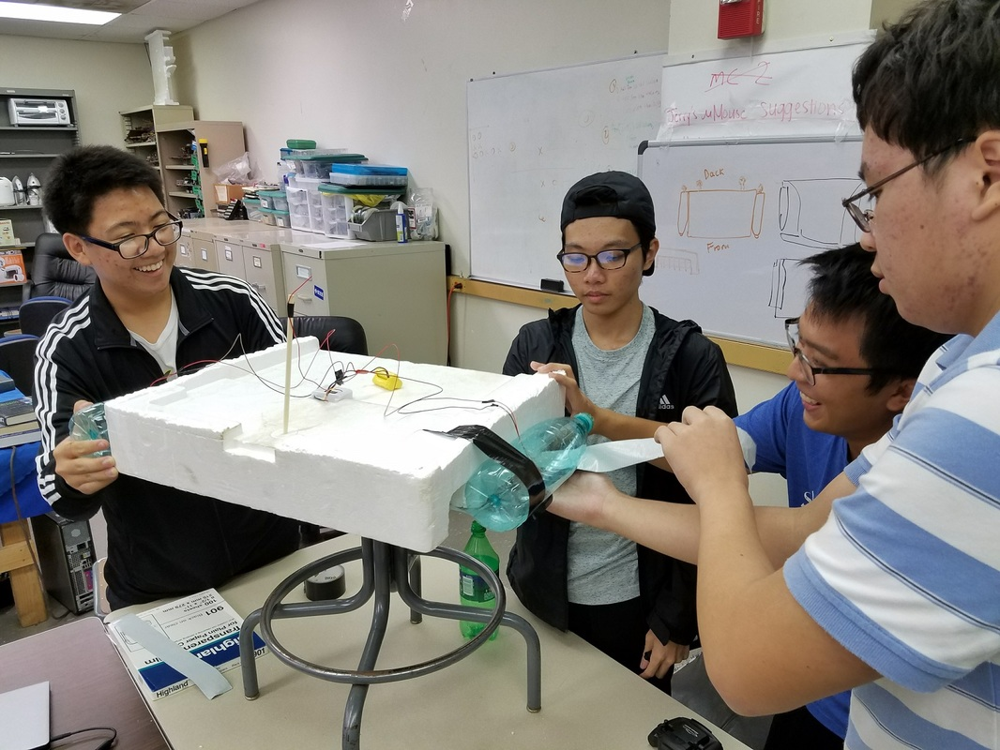
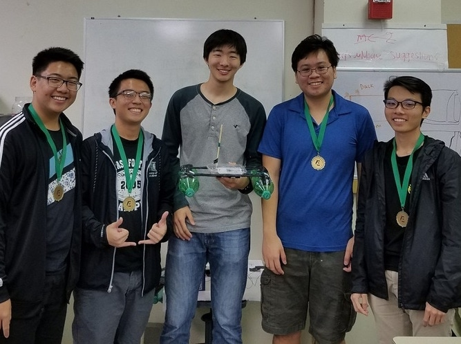

  
  
  
  

Blueprints is a program where incoming freshmen and transfer students get to participate in a semester-long engineering project while being mentored by representatives from a club. The purpose of this program is to give the new students some project experience as well as introduce them to various aspects of working on a team project. The challenge for Fall 2016 was to build a device that can remotely collect ping-pong balls from a pool of water. Each team was given a budget of $75 to design a working prototype. At the end of the semester, the teams presented their design and competed at the UH Manoa swimming pool.

For this project, our team under Eta Kappa Nu, an honor society dedicated for electrical and computer engineers, consisted of four students: Ryan Li, David Liang, Clinton Ng, and myself. Throughout the semester, we met, discussed, and created two working prototypes that were able to complete the task of collecting ping-pong balls. In order to stay within the budget, we allocated our funds to buying RC boats and used recyclable items such as styrofoam, bottles, and chopsticks. By committing our time into this project, we were able to win first place by collecting 29 balls in 58 seconds in combination with our presentation scores.

Throughout the semester, we simulated the engineering design process, going through the stages of defining the problem, brainstorming solutions, creating a prototype, testing the prototype, and reflecting and improving. Overall, we went through three iterations of prototypes in order to create the best device that can collect multiple ping-pong balls quickly, reflecting each time in order to improve our design. 

By participating in this project, I was able introduced to many different engineering aspects and gained many important skills necessary in the work field. Before starting to work on the prototypes, we learned about Gantt charts and the importance of time management. In addition, we also gained first-hand experience with soldering by installing the motors from the RC boats we bought into our model. Lastly, we were able to practice working in a group, public speaking, and time-mangaement skills. 

You can learn more at the [Eta Kappa Nu - Fall 2016 Blueprints](http://hknhawaii.weebly.com/blueprints1.html).

