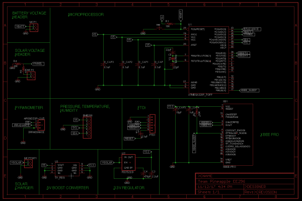
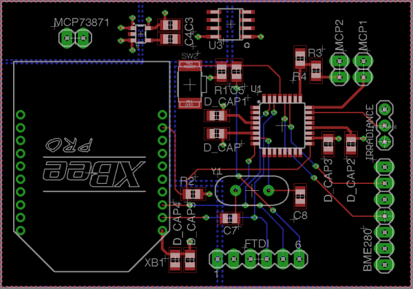
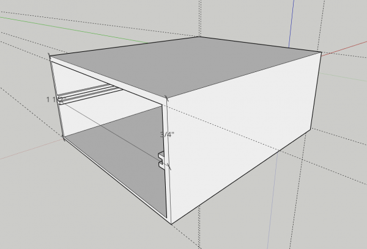
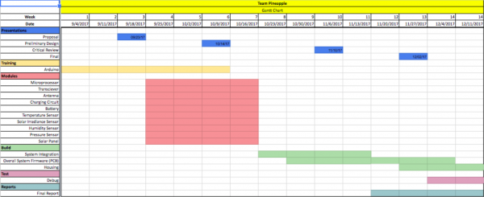

  
  
  
  

The Smart Campus Energy Lab is dedicated to collecting meteorological data by deploying environmental sensory nodes called "weatherboxes" on the roof of Holmes Hall; this collection of data is then utilized to predict forecast weather which would allow for the sustainability of energy by collecting and storing solar energy properly. The project's future goal is to turn the University of Hawaii at Manoa into a micro-grid, a small-scale grid that is self-sustainable by creating enough energy as needed so that the land may thrive without being connected to the power grid.

In this semester, my team and I designed and coded a weatherbox prototype that would collect meteorological data when deployed by utilizing the SP215 solar irradiance sensor; BME280 temperature, pressure, and humidity sensor; and the XBEE transmitter. Using an Arduino, I mainly worked on the coding aspect, utilizing the separate sensor libraries and integrating them into a weatherbox code routine. The node would construct the data packet, transmit the packet to the lab gateway, clear the packet, then repeat the process. More information can be found in the GitHub link at the bottom of the page. In addition to coding, we also learned how to create a schematic and PCB (printed circuit board) design using Autodesk's EAGLE software. 

From this experience, I was able to gain more engineering skills in both hardware and software. By compiling the code into a routine, I continued practicing with coding in C. Additionally, I learned more about designing a circuit board and the process to create a efficient PCB. Furthermore, by having a proposal, preliminary design review, critical design review, and final presentation, I was able to practice my presentation skills on technical topics in front of an audience of about 30 students. 

You can learn more at [Wiki SCEL Team Pineapple](https://wiki.scel-hawaii.org/doku.php?id=weatherbox:team_pineapple:start).

Source: <a href="https://github.com/liukeving/TeamPineapple"><i class="large github icon "></i>liukeving/TeamPineapple</a>

